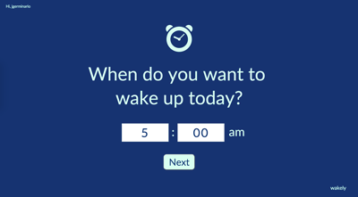
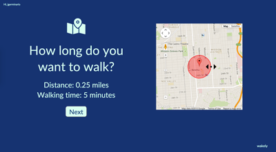
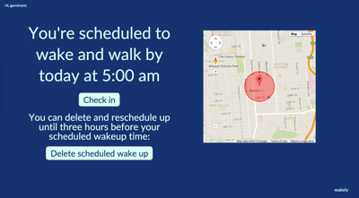

# [Wakely](http://wakely.herokuapp.com)

Wakely helps you to wake up with social incentivization. After linking your Twitter account, set up a time to wake up and a distance to walk. If you cannot make it past that distance, an embarrassing tweet will be sent to your followers.

## How it works

Upon opening Wakely, connect your Twitter account. Twitter access can be revoked at any time from your Twitter application settings. Wakely will never write or read from your account outside of your approved wake-up tweet.

You will see a splash page explaining how Wakely works:

The first step is to specify when you want to wake up in the morning:

The next step is to set your distance. To verify that you woke up on time, Wakely requires that you walk a certain distance out of your apartment. It guarantees you get yourself out of bed!

Finally, specify the embarrassing tweet you want to send to your followers if you don't wake up on time:

Your commitment will then be saved and appear whenever you revisit wakely.herokuapp.com. To check in, use your mobile phone to select 'check-in' after you get beyond the distance radius you set.

You can delete your commitment up until three hours before your scheduled wake up time (after that it's cheating!)

## Technologies
Wakely is deployed at wakely.herokuapp.com and is fully functional, with Sidekiq/Redis-based background jobs running the Twitter event checks.

  * **Sinatra**: Backend framework (Ruby)
  * **PostgreSQL**: Database
  * **Google Maps API and geolocation**: Developed for map radius functionality
  * **Sidekiq/Clockwork + Redis background jobs**: Background jobs manage the tweet schedule check
  * **JavaScript/jQuery**: Front-end
  * **Heroku**: Deployment
  * **RSpec**: Backend testing
  * **Twitter oAuth**: For Twitter commitments

## Known issues and planned features

* Responsive design for site planned
* Background jobs not always fully reliable as they are running on the main Heroku web instance instead of separate worker dynos (to save on dyno costs). Tweets will never get sent out accidentally, but sometimes a tweet won't get fired off due to script crashes.

Please report any bugs or feedback to jgerminario@gmail.com or on the repo issues. Enjoy your morning!
